# SmartMart

### Introduction
SmartMart is an ecommerce site with an advanced search feature incorporating AI. With minimalist design created with Tailwind CSS, the site is simple to navigate and has robust functionality. The search feature incorporates AlogoliaSearch API and GPT-3.5-Turbo to attempt to analysis natural language and suggest relevant products.

This app was created by Zhihao Qiu, and Bastien Moy as a final project for the Lighthouse Labs Web Development bootcamp.

### Get Started
1. Create the .env in backend by using .env.example as a reference: cp .env.example .env
2. Copy `env.js.example` to `.env.js` in frontend
3. Install dependencies: npm i

### Starting as a Single App (for Production only)
```
npm install
npm run build
npm start
```

### Starting as Individual Apps (for Development)
```
cd backend
npm install
npm run local

cd frontend
npm install
npm start
```

### Dependencies
- Node 15.x or above
- React 18.x or above
- React Router
- Tailwind CSS
- AlgoliaSearch
- Stripe

### Screenshots
- Homepage
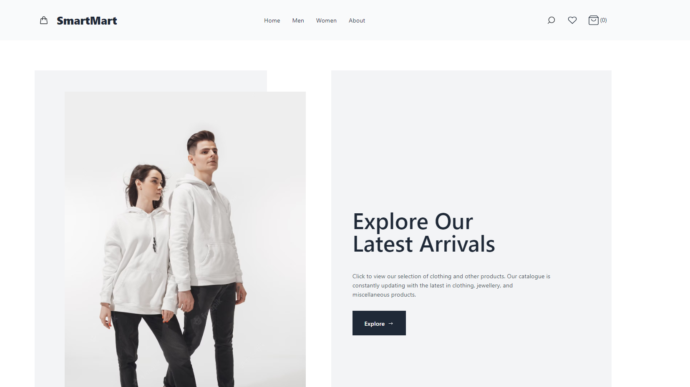
- Product List
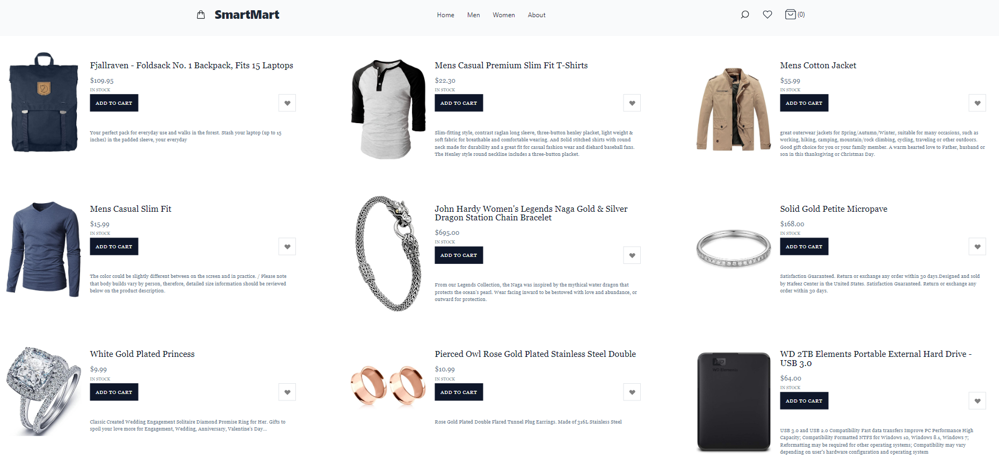
- Cart Modal
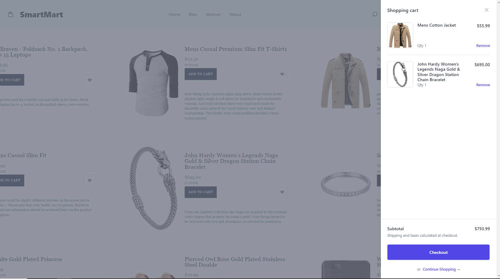
- Order Details
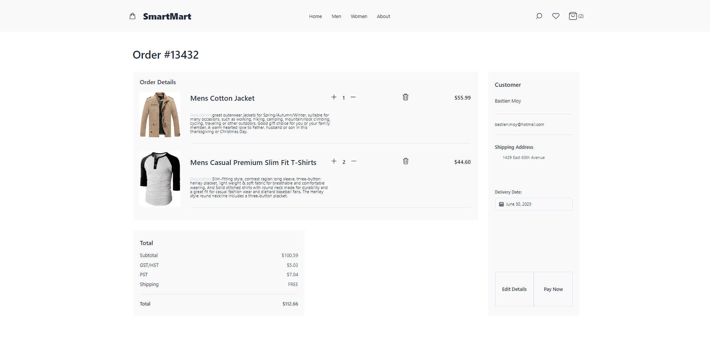
- Payment Confirmation
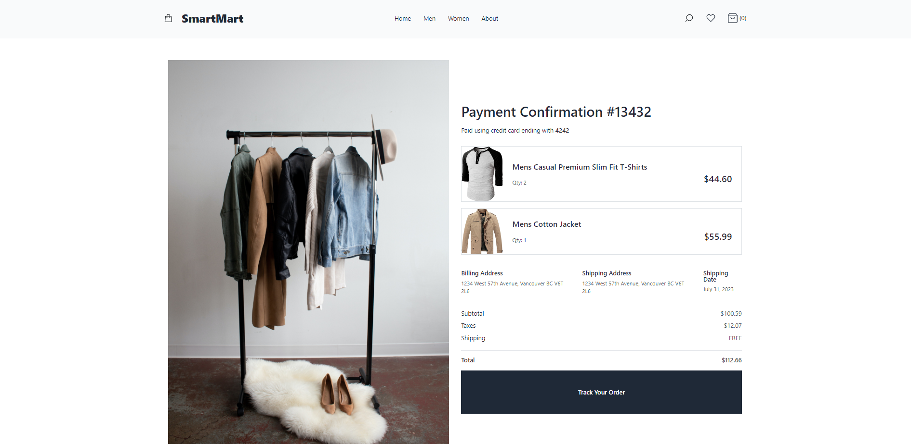
- Questions to check requirements
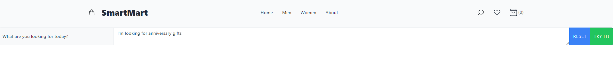
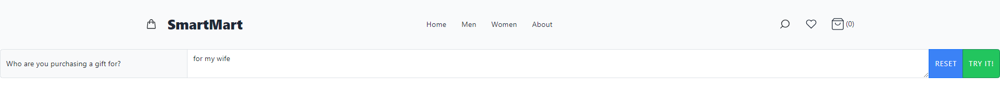
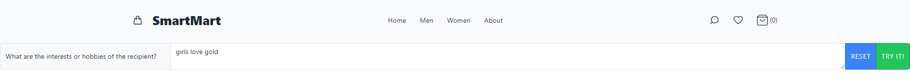
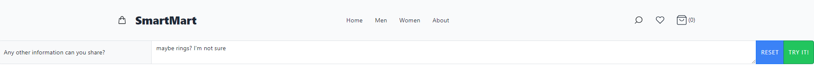
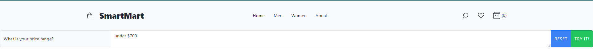
- Suggestions
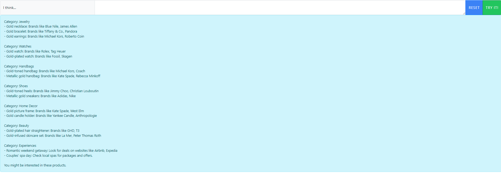
- Data Retrived from Database
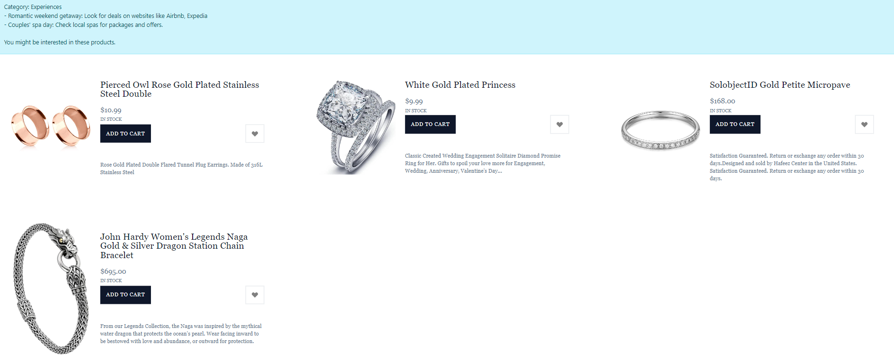